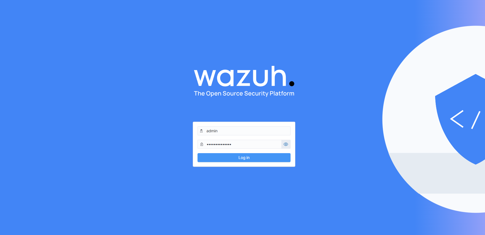
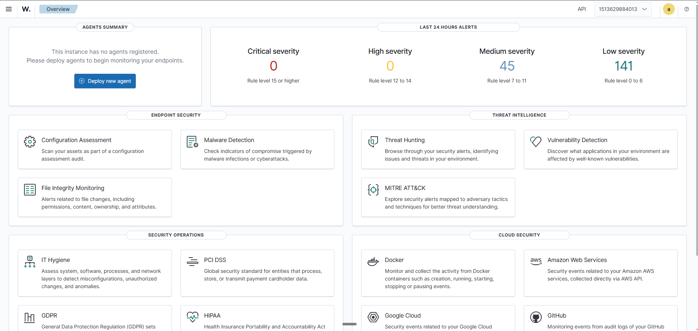
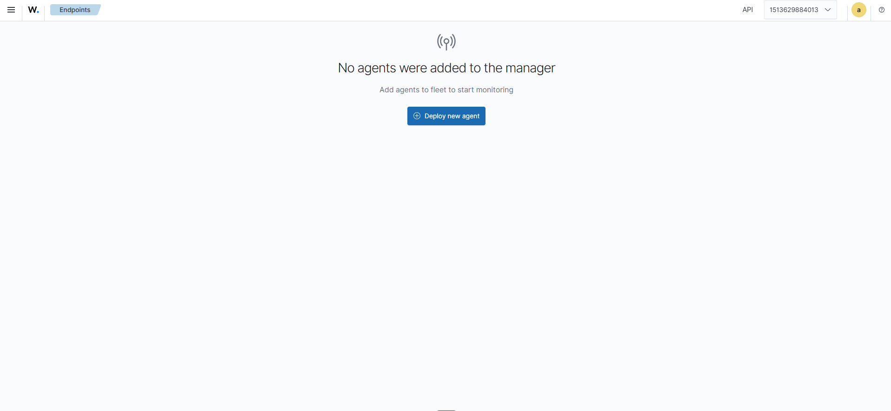

# Hassan Security Lab — Personal Cybersecurity Homelab

This is a personal SOC learning environment built to practice detection engineering on Ubuntu Desktop 24.04. It runs open-source security tooling on a single laptop in my home network, and exists so I can get hands-on experience with SIEM deployment, log onboarding, rule writing, and incident triage outside of coursework.

---

## Hardware

| Component | Details                                  |
|-----------|------------------------------------------|
| Device    | HP Envy laptop                           |
| CPU       | AMD A12-9720P (4 cores)                  |
| RAM       | 14 GB                                    |
| Storage   | 256 GB NVMe SSD (root) + 1 TB HDD        |
| HDD mount | `/mnt/hdd`                               |
| OS        | Ubuntu Desktop 24.04                     |

---

## Status

| Tool                          | Status       | Notes                                                                                  |
|-------------------------------|--------------|----------------------------------------------------------------------------------------|
| Wazuh 4.14.5 (single-node)    | ✅ Deployed  | Manager + Indexer + Dashboard via official docker-compose, data on HDD                 |
| ELK Stack                     | ⏳ Planned   | Folder placeholder only                                                                |
| Snort IDS                     | ⏳ Planned   | Folder placeholder only                                                                |
| Velociraptor                  | ⏳ Planned   | Folder placeholder only                                                                |
| MISP                          | ⏳ Planned   | Folder placeholder only                                                                |
| Shuffle SOAR                  | ⏳ Planned   | Folder placeholder only                                                                |

---

## Wazuh Deployment

Wazuh is deployed as a single-node stack using the official [wazuh-docker](https://github.com/wazuh/wazuh-docker) repository, pinned to tag **v4.14.5**. Three containers run: `wazuh.manager`, `wazuh.indexer`, and `wazuh.dashboard`. The dashboard is reachable at `https://192.168.3.71` on the host LAN.

**Docker data root migrated to HDD.** The default `/var/lib/docker` location lives on the 256 GB SSD, which is too small for indexer data over time. Docker's data root was moved to `/mnt/hdd/docker/data` by editing `/etc/docker/daemon.json`:

```json
{
  "data-root": "/mnt/hdd/docker/data"
}
```

Existing images and volumes were rsynced over before restarting the Docker service.

**Kernel parameter for the indexer.** The Wazuh indexer (OpenSearch) requires a higher `vm.max_map_count` than the Ubuntu default. Set persistently in `/etc/sysctl.d/99-wazuh.conf`:

```
vm.max_map_count=262144
```

Applied with `sudo sysctl --system`.

### Screenshots







---

## What I'm Currently Learning

- Detection engineering basics
- Rule writing in Wazuh (decoders, rules, ruleset structure)
- Log source onboarding
- MITRE ATT&CK framework
- Studying for CompTIA Security+ — exam scheduled end of May 2026

---

## Next Steps

- Enroll first agent (the Linux server itself) into the Wazuh manager
- Write 2–3 custom Wazuh rules for SSH brute-force detection
- Deploy ELK as a second SIEM for side-by-side comparison

---

## About

Hassan Abdulahi Hassan — BSc Computing, University of Greenwich (April 2026). Based in Nairobi, Kenya.
