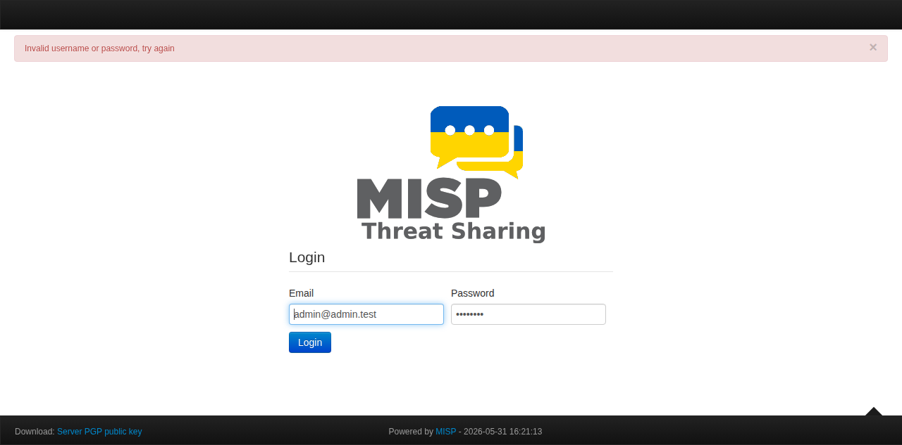

# MISP Threat Intelligence Platform

## What is MISP?

MISP (Malware Information Sharing Platform & Threat Sharing) is an open-source threat intelligence platform designed to improve the sharing of structured threat information. It allows security teams to collect, share, store, and correlate indicators of compromise (IOCs), threat actors, malware samples, and other threat intelligence data.

In this homelab, MISP serves as the central threat intelligence hub — feeding actionable IOCs into the Wazuh SIEM for automated detection and alerting.

## Why MISP in the Homelab?

| Purpose | Detail |
|---------|--------|
| IOC Management | Store and organize indicators of compromise (IPs, domains, file hashes, YARA rules) |
| Threat Feeds | Subscribe to global threat intelligence feeds (CIRCL, AlienVault OTX, abuse.ch) |
| Wazuh Integration | Push IOCs into Wazuh CDB lists for real-time log enrichment and correlation |
| Incident Response | Correlate security events against known threat actor TTPs |
| SOAR Integration | Trigger Shuffle SOAR playbooks on high-confidence IOC matches |

## Architecture

```
┌─────────────────────────────────────────────────────────────────┐
│                        MISP Stack                               │
│                                                                  │
│  ┌──────────────┐    ┌──────────────┐    ┌──────────────────┐   │
│  │   MISP Web    │    │  MariaDB     │    │    Redis Cache   │   │
│  │  (port 8080)  │◄──►│  10.11      │    │    7-alpine      │   │
│  │  nukib/misp   │    │  misp-db    │    │    misp-redis    │   │
│  └──────┬───────┘    └──────────────┘    └──────────────────┘   │
│         │                                                       │
│         │  REST API / Feed sync                                 │
│         ▼                                                       │
│  ┌──────────────────────────────────────────┐                   │
│  │          External Integrations            │                  │
│  │  ┌────────┐  ┌──────────┐  ┌──────────┐ │                  │
│  │  │ Wazuh  │  │  Shuffle │  │ External │ │                  │
│  │  │ SIEM   │  │  SOAR    │  │ Threat   │ │                  │
│  │  │ (IOC   │  │ (trigger │  │ Feeds    │ │                  │
│  │  │ lookup)│  │ playbook)│  │(CIRCL...)│ │                  │
│  │  └────────┘  └──────────┘  └──────────┘ │                  │
│  └──────────────────────────────────────────┘                   │
└─────────────────────────────────────────────────────────────────┘
```

## Deployment

### Docker Compose

The stack runs three containers defined in `home-lab/misp/docker-compose.yml`:

```yaml
services:
  misp:
    image: nukib/misp:latest
    ports:
      - "8080:80"
    environment:
      - MYSQL_HOST=misp-db
      - MYSQL_LOGIN=misp
      - MYSQL_DATABASE=misp
      - MYSQL_PASSWORD=***
      - REDIS_HOST=misp-redis
      - MISP_ORG=HassanSecurityLab
      - MISP_BASEURL=http://192.168.3.71:8080
      - SECURITY_SALT=longrandomstring32charsminimum
    volumes:
      - misp-config:/var/www/MISP/app/Config
      - misp-logs:/var/www/MISP/app/tmp/logs
      - misp-files:/var/www/MISP/app/files

  misp-db:
    image: mariadb:10.11
    volumes:
      - misp-mysql:/var/lib/mysql

  misp-redis:
    image: redis:7-alpine
```

### Quick Start

```bash
cd home-lab/misp
docker compose up -d
```

Access MISP at `http://192.168.3.71:8080`
Default login: `admin@admin.test` / `changeme`

### Initial Configuration

1. Change the default admin password immediately
2. Navigate to Sync Actions → List Feeds and enable relevant threat feeds
3. Generate an API key for Wazuh integration (Administration → List Auth Keys)
4. Set MISP_BASEURL to match your LAN IP

## Integration with Wazuh for IOC Enrichment

MISP integrates with Wazuh through CDB (Constant Database) lists for low-latency IOC lookups:

### Workflow

1. MISP fetches threat intelligence from curated feeds (CIRCL, abuse.ch, AlienVault)
2. A scheduled script exports new IOCs from MISP to Wazuh CDB list files
3. Wazuh rules reference these CDB lists during log analysis
4. When a log matches a known IOC, Wazuh generates a high-priority alert with threat context
5. Alerts feed into the Shuffle SOAR for automated response actions

### Integration Commands

Export IOCs from MISP to CDB format:

```bash
# Fetch known malicious IPs from MISP
curl -k -H "Authorization: YOUR_MISP_API_KEY" \
  -H "Accept: application/json" \
  "http://192.168.3.71:8080/attributes/restSearch/returnFormat:json/type:ip-src,ip-dst" | \
  jq -r '.response.Attribute[] | "\(.value):misp:malicious"' > /var/ossec/etc/lists/misp-ip-list
```

Add the CDB list to Wazuh's `ossec.conf`:

```xml
<ruleset>
  <list>etc/lists/misp-ip-list</list>
</ruleset>
```

Create Wazuh rules to alert on CDB matches:

```xml
<rule id="100200" level="12">
  <if_sid>510</if_sid>
  <list field="srcip" lookup="match_key_value">etc/lists/misp-ip-list</list>
  <description>MISP: Known malicious IP detected</description>
</rule>
```

### Shuffle SOAR Integration

The Shuffle SOAR workflow (see `home-lab/shuffle-soar/`) is configured to:
1. Receive Wazuh alerts via webhook
2. Query MISP API for additional IOC context
3. Enrich the alert with threat actor and TTP data
4. Trigger remediation actions based on severity

## Screenshots



## Current Deployment Status

MISP is fully deployed and operational at `http://192.168.3.71:8080`.
- MISP Web: ✅ Healthy (nukib/misp:latest)
- MariaDB: ✅ Running (persistent volume)
- Redis: ✅ Running (session cache)
- Threat Feeds: ⏳ Configuring initial feed subscriptions
- Wazuh CDB Integration: ⏳ Export script pending

## Troubleshooting

| Issue | Solution |
|-------|----------|
| Container starts but database auth fails | Ensure MYSQL_LOGIN=misp is set (not MYSQL_USER which the image ignores) |
| Container restarts in a loop | Remove volumes with `docker compose down -v` and restart |
| Cannot reach MISP on port 8080 | Check that the misp container is healthy: `docker ps --filter name=misp` |
| Database init takes long | First start requires ~2 minutes for MariaDB and MISP schema setup |

## Directory Structure

```
misp/
├── README.md                 # This documentation
├── screenshots/
│   └── misp-dashboard.png   # Live dashboard screenshot
home-lab/misp/
├── docker-compose.yml        # Container orchestration
├── .env.example             # Environment template
└── README.md                # Detailed deployment notes
```

## Resources

- [MISP Official Documentation](https://www.circl.lu/doc/misp/)
- [MISP Docker (NUKIB)](https://github.com/NUKIB/misp)
- [Wazuh MISP Integration Guide](https://documentation.wazuh.com/current/user-manual/capabilities/malware-detection/misp-integration.html)
- [Shuffle SOAR](https://shuffler.io/)
